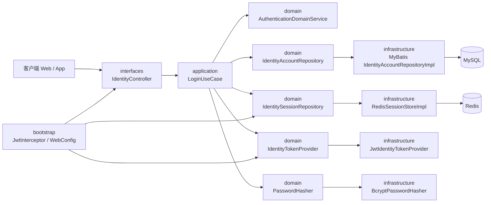
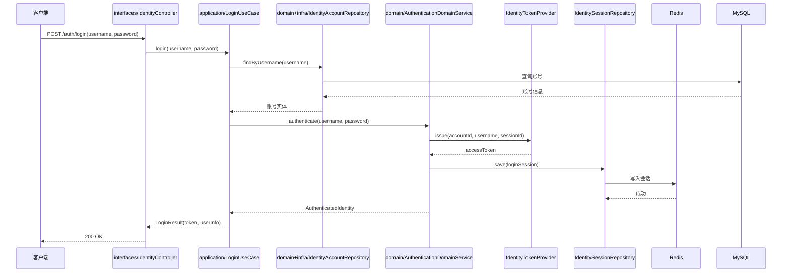
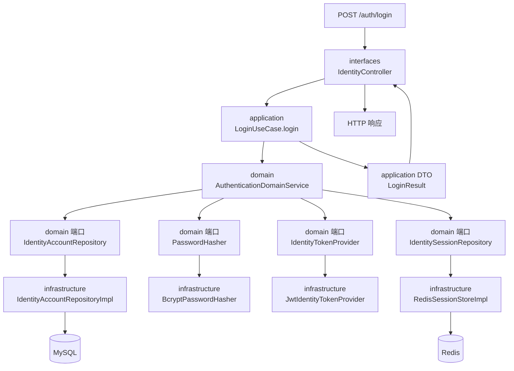

# 登录系统架构图

## 组件架构图



## 登录时序图



## 基本说明

- `interfaces` 只负责请求和响应转换。
- `application` 负责登录用例编排。
- `domain` 负责核心模型、规则和端口定义。
- `infrastructure` 负责 MyBatis、Redis、JWT、密码加密等适配实现。
- `bootstrap` 负责拦截器、MVC 配置和应用装配。

## 当前项目映射

### 现有模块

- `auth-service-interfaces`
  - 当前入口：`IdentityController`
- `auth-service-application`
  - 当前用例：`LoginUseCase`、`LogoutUseCase`、`RegisterUseCase`、`UpdatePasswordUseCase`、`AuthenticateUseCase`
- `auth-service-domain`
  - 当前模型：`IdentityAccount`、`IdentitySession`
  - 当前端口：`IdentityAccountRepository`、`IdentitySessionRepository`、`IdentityTokenProvider`、`PasswordHasher`
- `auth-service-infrastructure`
  - 当前仓储实现：`IdentityAccountRepositoryImpl`、`RedisSessionStoreImpl`
  - 当前适配实现：`JwtIdentityTokenProvider`、`BcryptPasswordHasher`
  - 当前持久化：MyBatis Mapper + XML、Redis
- `auth-service-common`
  - 当前共享能力：`JwtUtil`、`JwtProperties`、`PassToken`
- `auth-service-bootstrap`
  - 当前运行配置：`AuthServiceApplication`、`JwtInterceptor`、`WebConfig`

## 面向当前项目的目标登录架构



## 当前流程与目标流程对比

### 当前流程

```text
IdentityController
  -> LoginUseCaseImpl.login
  -> AuthenticationDomainService.authenticate
  -> IdentityAccountRepository.findByUsername
  -> PasswordHasher.matches
  -> IdentityTokenProvider.issue
  -> IdentitySessionRepository.save
  -> response header Authorization
```

### 目标流程

```text
IdentityController
  -> LoginUseCase.login(username, password)
  -> AuthenticationDomainService.authenticate
  -> IdentityAccountRepository.findByUsername
  -> IdentityTokenProvider.issue
  -> IdentitySessionRepository.save(IdentitySession)
  -> LoginResult
```

## 改造方向

### 1. interfaces 层

- 保留 `IdentityController` 作为认证接口入口。
- 只负责：
  - 请求参数校验
  - 请求对象转用例入参
  - 结果对象转响应对象

### 2. application 层

- 使用明确的 use case 组织认证流程。
- 当前已具备：
  - `LoginUseCase`
  - `LogoutUseCase`
  - `RegisterUseCase`
  - `UpdatePasswordUseCase`
- 这一层只负责“调度”，不承载底层技术细节。

### 3. domain 层

- 保留 `IdentityAccount`、`IdentitySession` 作为核心模型。
- 明确的认证端口：
  - `PasswordHasher`
  - `IdentityTokenProvider`
  - `IdentitySessionRepository`
- 核心认证规则收敛在：
  - `AuthenticationDomainService`

### 4. infrastructure 层

- 保留 MyBatis 仓储实现。
- 用 BCrypt 适配器替代明文密码比较。
- Redis 保存结构化登录会话。

### 5. bootstrap 层

- 保留请求拦截和应用装配职责。
- 拦截器改为只负责：
  - 解析 token
  - 解析并校验 session
  - 构建请求上下文
  - 请求结束后清理上下文

## 登录会话模型建议

```text
LoginSession
  sessionId
  accountId
  username
  token
```

## Token 载荷建议

```json
{
  "sub": "username",
  "uid": 1001,
  "sid": "session-id",
  "tv": 1,
  "iat": 1710000000,
  "exp": 1710001800
}
```

## 模块边界约束

- `interfaces` 不能直接访问 MyBatis 或 Redis。
- `application` 不应依赖 HTTP 语义。
- `domain` 不能直接依赖 Spring MVC、MyBatis、Redis API。
- `infrastructure` 负责实现端口，不负责定义用例。
- `bootstrap` 只负责装配，不承载核心业务规则。
