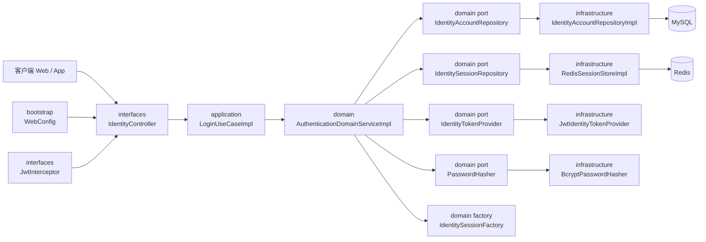
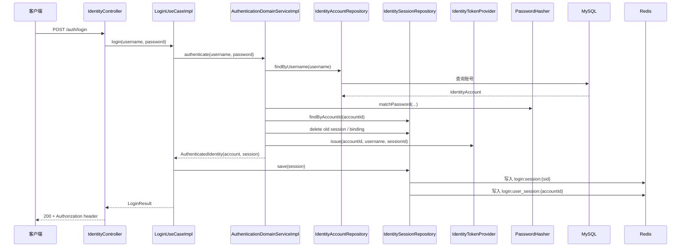

# 登录架构说明

## 目标

说明当前项目里登录能力的真实分层结构、调用顺序和模块映射。

本文描述的是当前实现，不再混用“目标架构”和“历史改造草图”。

## 当前组件架构图



## 登录时序图



## 当前登录实现

当前登录入口位于：

- [`auth-center-interfaces/src/main/java/com/example/authcenter/controller/IdentityController.java`](../auth-center-interfaces/src/main/java/com/example/authcenter/controller/IdentityController.java)

当前登录用例位于：

- [`auth-center-application/src/main/java/com/example/authcenter/identity/usecase/impl/LoginUseCaseImpl.java`](../auth-center-application/src/main/java/com/example/authcenter/identity/usecase/impl/LoginUseCaseImpl.java)

核心认证规则位于：

- [`auth-center-domain/src/main/java/com/example/authcenter/domain/identity/service/impl/AuthenticationDomainServiceImpl.java`](../auth-center-domain/src/main/java/com/example/authcenter/domain/identity/service/impl/AuthenticationDomainServiceImpl.java)

会话持久化位于：

- [`auth-center-infrastructure/src/main/java/com/example/authcenter/infra/service/RedisSessionStoreImpl.java`](../auth-center-infrastructure/src/main/java/com/example/authcenter/infra/service/RedisSessionStoreImpl.java)

## 当前流程分层

### `interfaces`

职责：

- 校验 HTTP 请求体
- 调用 `LoginUseCase`
- 设置响应头 `Authorization: Bearer <token>`
- 返回统一响应体

### `application`

当前 `LoginUseCaseImpl` 只做两件事：

- 调用领域服务完成认证
- 持久化领域返回的新会话，并转成 `LoginResult`

它不负责：

- 查询账号
- 密码校验
- 旧会话替换
- token 生成

### `domain`

当前 `AuthenticationDomainServiceImpl` 负责：

- 根据用户名查找账号
- 校验密码
- 查找并撤销旧会话
- 生成新的 `sessionId`
- 生成新的 JWT
- 创建新的 `IdentitySession`

当前项目已明确采用单点登录策略：

```text
一个账号同一时间只保留一个有效 session
新登录覆盖旧 session
```

### `infrastructure`

当前实现包括：

- MyBatis 账号仓储
- Redis 会话存储
- JWT token provider
- BCrypt 密码哈希器

Redis key 结构为：

```text
login:session:{sid}
login:user_session:{accountId}
```

## 模块映射

- `auth-center-interfaces`
  - `IdentityController`
- `auth-center-application`
  - `LoginUseCaseImpl`
  - `AuthenticateUseCaseImpl`
  - `LogoutUseCaseImpl`
  - `RegisterUseCaseImpl`
  - `UpdatePasswordUseCaseImpl`
- `auth-center-domain`
  - `IdentityAccount`
  - `IdentitySession`
  - `AuthenticationDomainServiceImpl`
  - `RegistrationDomainService`
  - `CredentialDomainService`
  - `SessionDomainService`
- `auth-center-infrastructure`
  - `IdentityAccountRepositoryImpl`
  - `RedisSessionStoreImpl`
  - `JwtIdentityTokenProvider`
  - `BcryptPasswordHasher`
- `auth-center-bootstrap`
  - `AuthCenterApplication`
  - `WebConfig`

## 当前设计结论

和早期版本相比，现在登录架构已经发生了两个明确变化：

1. 认证决策已经从应用层下沉到领域服务
2. 登录态已经收敛为 session 模型，而不是按用户名保存简单缓存

因此后续再看登录链路时，应当以“领域服务产出 `AuthenticatedIdentity`，应用层负责落库和返回结果”作为主理解模型。
