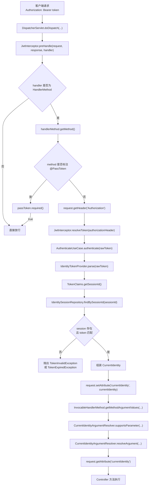
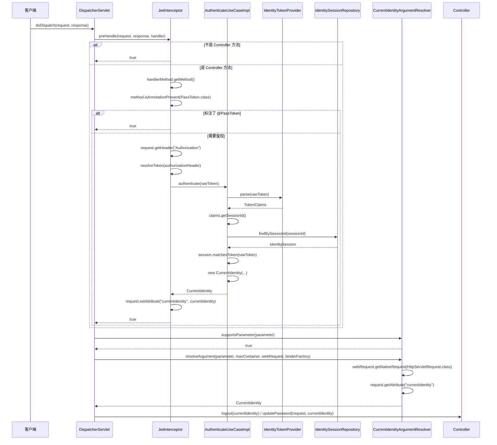

# 请求鉴权拦截链路

## 目标

描述一个带 `Authorization: Bearer <token>` 的请求，从进入服务到到达 controller 层之前，当前项目是如何完成鉴权和身份注入的。

## 总览流程图



## 时序图



## 方法调用清单

按当前代码实现，请求到 controller 前的关键方法调用顺序如下：

```text
DispatcherServlet.doDispatch(...)
  -> HandlerExecutionChain.applyPreHandle(...)
    -> JwtInterceptor.preHandle(request, response, handler)
      -> handlerMethod.getMethod()
      -> method.isAnnotationPresent(PassToken.class)
      -> request.getHeader("Authorization")
      -> JwtInterceptor.resolveToken(authorizationHeader)
      -> AuthenticateUseCaseImpl.authenticate(rawToken)
        -> IdentityTokenProvider.parse(rawToken)
        -> TokenClaims.getSessionId()
        -> IdentitySessionRepository.findBySessionId(sessionId)
        -> IdentitySession.matchesToken(rawToken)
        -> new CurrentIdentity(...)
      -> request.setAttribute("currentIdentity", currentIdentity)
  -> InvocableHandlerMethod.getMethodArgumentValues(...)
    -> CurrentIdentityArgumentResolver.supportsParameter(parameter)
    -> CurrentIdentityArgumentResolver.resolveArgument(...)
      -> webRequest.getNativeRequest(HttpServletRequest.class)
      -> request.getAttribute("currentIdentity")
  -> Controller.logout(@AuthIdentity CurrentIdentity)
     或 Controller.updatePassword(..., @AuthIdentity CurrentIdentity)
```

## Controller 层看到的形态

鉴权成功后，controller 不需要自己读取 `HttpServletRequest`，而是直接声明参数：

```java
@PostMapping("/logout")
public Result<Boolean> logout(@AuthIdentity CurrentIdentity currentIdentity) {
    return Result.success(logoutUseCase.logout(currentIdentity.getId(), currentIdentity.getSessionId()));
}
```

```java
@PostMapping("/update-password")
public Result<Boolean> updatePassword(@Valid @RequestBody UpdatePasswordRequest request,
                                      @AuthIdentity CurrentIdentity currentIdentity) {
    accountService.updatePassword(
            currentIdentity.getUsername(),
            currentIdentity.getId(),
            currentIdentity.getSessionId(),
            request.getOldPassword(),
            request.getNewPassword()
    );
    return Result.success(true);
}
```

## 当前项目代码映射

- 拦截入口
  - `auth-service-bootstrap/src/main/java/com/example/authservice/config/JwtInterceptor.java`
- 鉴权用例
  - `auth-service-application/src/main/java/com/example/authservice/identity/usecase/impl/AuthenticateUseCaseImpl.java`
- 会话仓储
  - `auth-service-domain/src/main/java/com/example/authservice/domain/identity/repository/IdentitySessionRepository.java`
  - `auth-service-infrastructure/src/main/java/com/example/authservice/infra/service/RedisSessionStoreImpl.java`
- 当前身份参数解析器
  - `auth-service-bootstrap/src/main/java/com/example/authservice/config/CurrentIdentityArgumentResolver.java`
- MVC 注册
  - `auth-service-bootstrap/src/main/java/com/example/authservice/config/WebConfig.java`
- controller 身份注入点
  - `auth-service-interfaces/src/main/java/com/example/authservice/controller/IdentityController.java`
  - `auth-service-interfaces/src/main/java/com/example/authservice/controller/AccountController.java`

## 分层职责

- `bootstrap`
  - 负责拦截请求、调用鉴权用例、把身份写入 request、注册参数解析器
- `application`
  - 负责 token 鉴权用例编排
- `domain`
  - 负责会话仓储端口、token 解析端口、登录态有效性规则
- `infrastructure`
  - 负责 Redis 会话存储、JWT 解析实现
- `interfaces`
  - 负责接收已认证身份并继续调用应用层用例

## 这条链路的设计要点

- 身份上下文只在接口适配层传递，不再依赖 `ThreadLocal`
- `JwtInterceptor` 只负责“认证并写入 request attribute”
- controller 通过 `@AuthIdentity` 显式声明自己依赖当前身份
- application 层只接收显式参数，不感知 HTTP 请求对象
