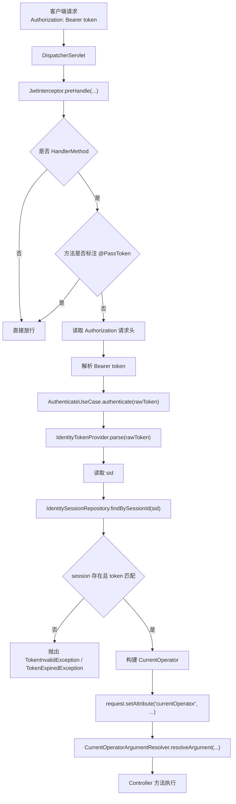
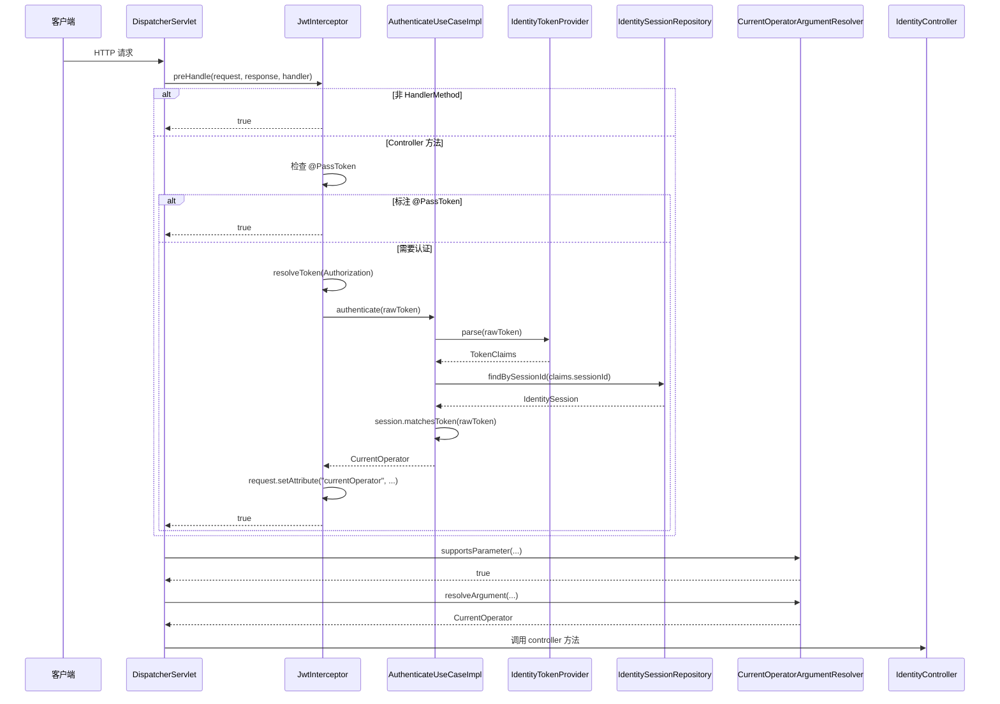

# 请求鉴权拦截链路

## 目标

说明当前项目里，一个携带 `Authorization: Bearer <token>` 的请求，是如何在进入 controller 之前完成认证和当前身份注入的。

本文描述的是当前代码事实，不是历史方案。

## 当前实现总览

当前链路分布在三个位置：

- 接口层拦截器：[`auth-center-interfaces/src/main/java/com/example/authcenter/config/JwtInterceptor.java`](../auth-center-interfaces/src/main/java/com/example/authcenter/config/JwtInterceptor.java)
- 应用层鉴权用例：[`auth-center-application/src/main/java/com/example/authcenter/identity/usecase/impl/AuthenticateUseCaseImpl.java`](../auth-center-application/src/main/java/com/example/authcenter/identity/usecase/impl/AuthenticateUseCaseImpl.java)
- 当前身份参数解析器：[`auth-center-interfaces/src/main/java/com/example/authcenter/config/CurrentOperatorArgumentResolver.java`](../auth-center-interfaces/src/main/java/com/example/authcenter/config/CurrentOperatorArgumentResolver.java)

MVC 注册入口位于：

- [`auth-center-bootstrap/src/main/java/com/example/authcenter/config/WebConfig.java`](../auth-center-bootstrap/src/main/java/com/example/authcenter/config/WebConfig.java)

## 总览流程图



## 时序图



## 关键方法调用顺序

```text
DispatcherServlet
  -> JwtInterceptor.preHandle(...)
    -> method.isAnnotationPresent(PassToken.class)
    -> request.getHeader("Authorization")
    -> JwtInterceptor.resolveToken(...)
    -> AuthenticateUseCaseImpl.authenticate(rawToken)
      -> IdentityTokenProvider.parse(rawToken)
      -> IdentitySessionRepository.findBySessionId(sessionId)
      -> IdentitySession.matchesToken(rawToken)
      -> new CurrentOperator(...)
    -> request.setAttribute("currentOperator", currentOperator)
  -> CurrentOperatorArgumentResolver.supportsParameter(...)
  -> CurrentOperatorArgumentResolver.resolveArgument(...)
  -> Controller 方法执行
```

## 当前项目的几个关键点

### 1. `@PassToken` 只跳过方法级校验

当前 `JwtInterceptor` 只检查方法上的 `@PassToken`，没有检查类级别注解。

### 2. 当前登录态是按 `sessionId` 鉴权

当前不是“按 username 从 Redis 查登录态”，而是：

```text
token -> sid -> redis(login:session:{sid}) -> IdentitySession
```

同时 Redis 里还维护：

```text
login:user_session:{accountId} -> sid
```

实现见：

- [`auth-center-infrastructure/src/main/java/com/example/authcenter/infra/service/RedisSessionStoreImpl.java`](../auth-center-infrastructure/src/main/java/com/example/authcenter/infra/service/RedisSessionStoreImpl.java)

### 3. `CurrentOperator` 通过 request attribute 传递

当前实现不依赖 `ThreadLocal` 上下文，而是：

- 拦截器写入 `request.setAttribute("currentOperator", ...)`
- 参数解析器读取并注入 `@AuthIdentity CurrentOperator`

### 4. 应用层只做 token 鉴权，不感知 HTTP

`AuthenticateUseCaseImpl` 的职责是：

- 解析 JWT
- 读取 sessionId
- 查询当前有效会话
- 组装 `CurrentOperator`

它不直接依赖 `HttpServletRequest` 或 Spring MVC API。

## Controller 层看到的形态

```java
@PostMapping("/logout")
public Result<Boolean> logout(@AuthIdentity CurrentOperator currentOperator) {
    return Result.success(logoutUseCase.logout(new LogoutCommand(currentOperator)));
}
```

```java
@PostMapping("/update-password")
public Result<Boolean> updatePassword(@Valid @RequestBody UpdatePasswordRequest request,
                                      @AuthIdentity CurrentOperator currentOperator) {
    updatePasswordUseCase.updatePassword(new UpdatePasswordCommand(
            currentOperator,
            request.oldPassword(),
            request.newPassword()
    ));
    return Result.success(true);
}
```

## 分层职责

- `interfaces`
  负责拦截请求、解析身份参数、承接 controller
- `application`
  负责 token 鉴权用例编排
- `domain`
  负责 token claims、session 模型、登录态有效性规则和端口定义
- `infrastructure`
  负责 JWT 和 Redis 的技术实现
- `bootstrap`
  负责 MVC 组装与注册

## 当前文档结论

这条链路已经完成了三件重要事情：

- 认证上下文从“隐式上下文”改成了显式的 `CurrentOperator`
- 登录态校验从“按 username 查缓存”切到了“按 sid 查 session”
- HTTP 层与业务层之间通过用例和参数解析器解耦
